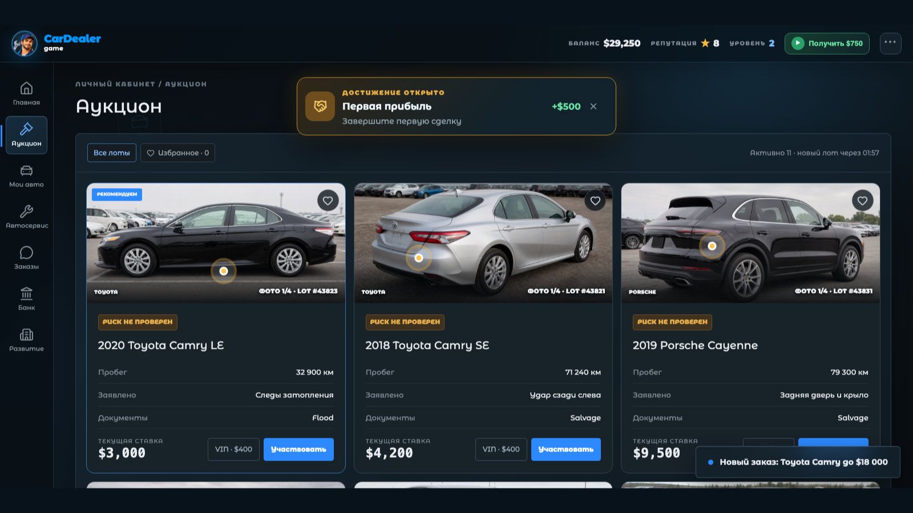

# Car Dealer: From Garage to Showroom


A browser-based car dealership simulator. Find client orders, bid on damaged
cars at live auctions, arrange delivery, diagnose and repair vehicles, then
close profitable deals and grow the business.

**Russian title:** «Автодилер: Из гаража в автосалон»

## Gameplay

- accept customer orders with different budgets and risk levels;
- choose between inspected and high-risk auction lots;
- compete with simulated bidders in real-time auctions;
- organize vehicle delivery and workshop repairs;
- upgrade the garage, suppliers, service and auction access;
- manage cash flow, reputation and company progression;
- play in Russian or English;
- use rewarded ads through the Yandex Games SDK.



## Tech stack

- React 19 and TypeScript
- vinext / Vite
- CSS-based responsive desktop and mobile interface
- Yandex Games SDK integration
- local and cloud save support
- Node.js test for validating the export archive

## Run locally

Requirements: Node.js 22.13 or newer.

```bash
npm install
npm run dev
```

Open the address printed by the development server.

## Build and verify

```bash
npm test
```

The command creates the static build in `dist/client` and validates the HTML,
asset paths, archive size and Yandex Games SDK bootstrap.

## Yandex Games

The production export uses relative asset URLs because archive games are served
from a nested platform path. `/sdk.js` intentionally stays root-relative as the
Yandex Games platform provides that proxy endpoint.

## Project status

Playable portfolio project prepared for Yandex Games moderation. The repository
contains the source code and promotional assets; generated build directories and
upload archives are intentionally excluded.

## Author

Designed and developed as an independent game project.
